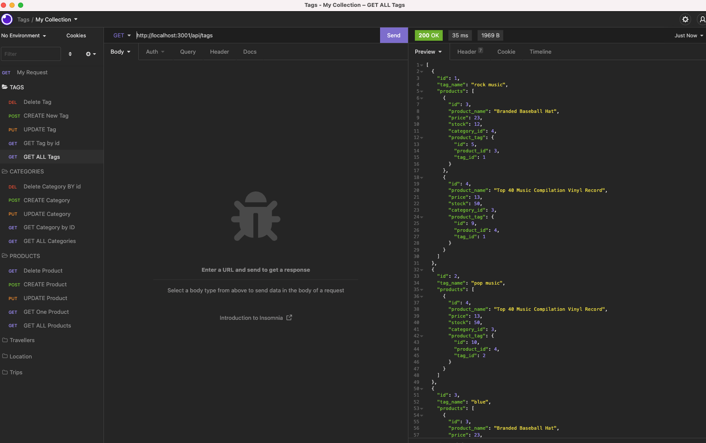
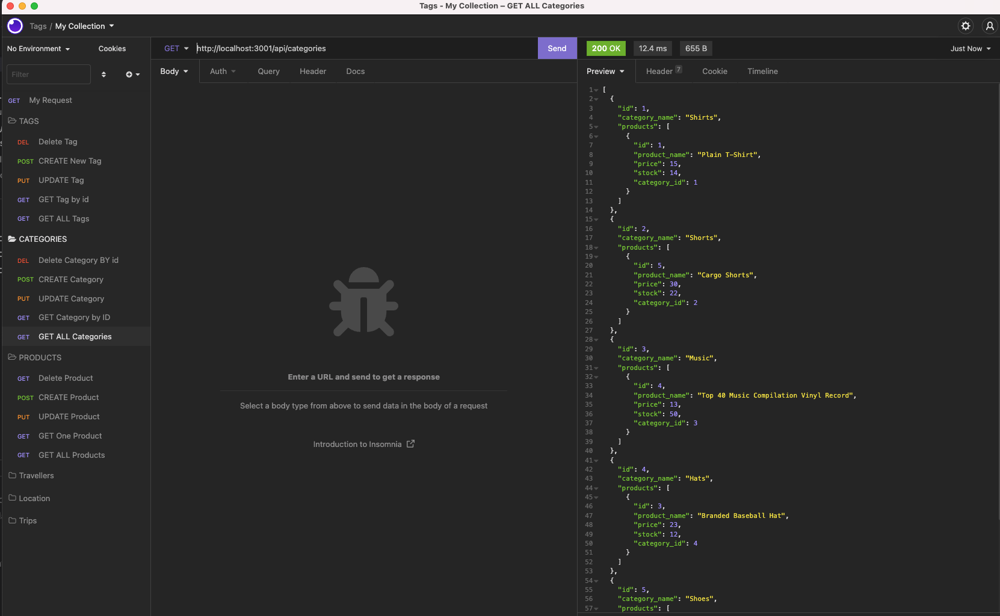
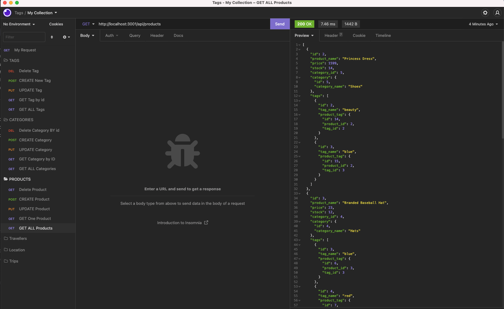
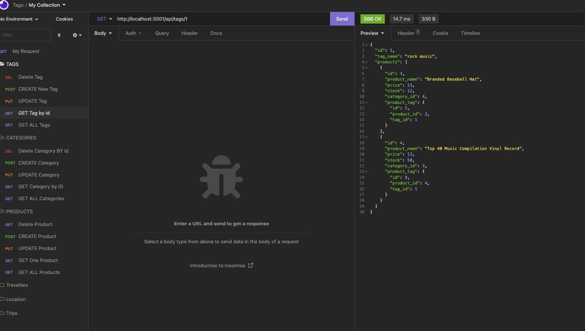
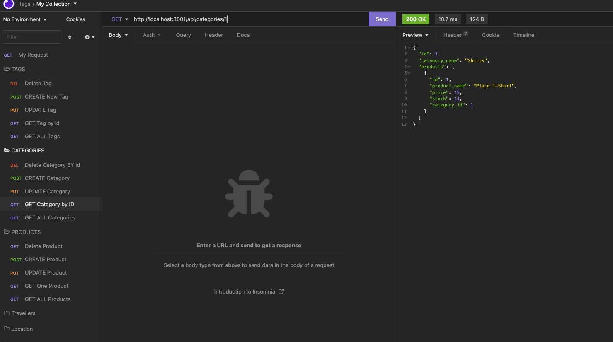
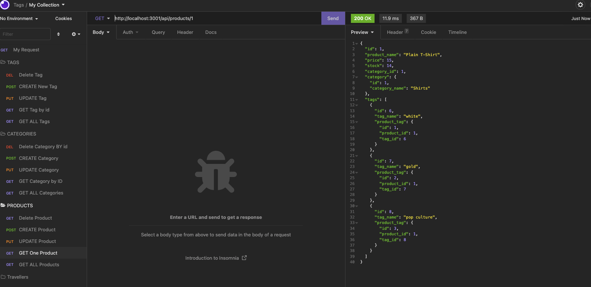
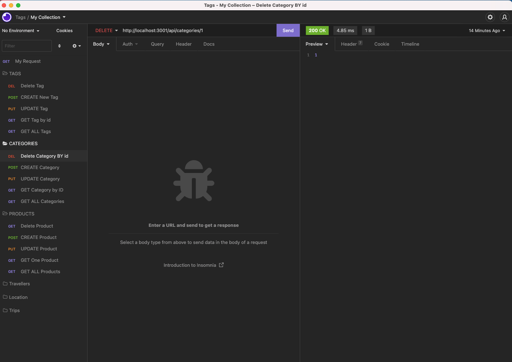
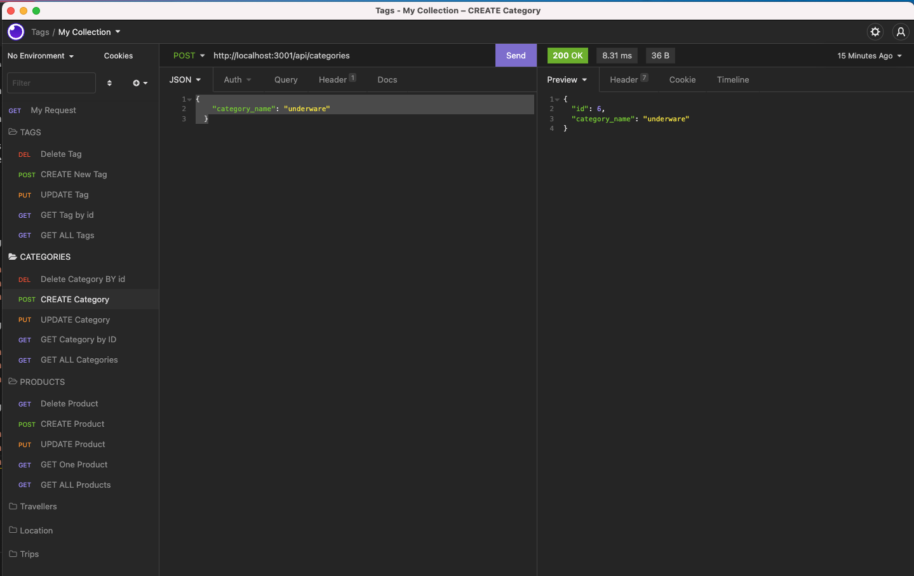
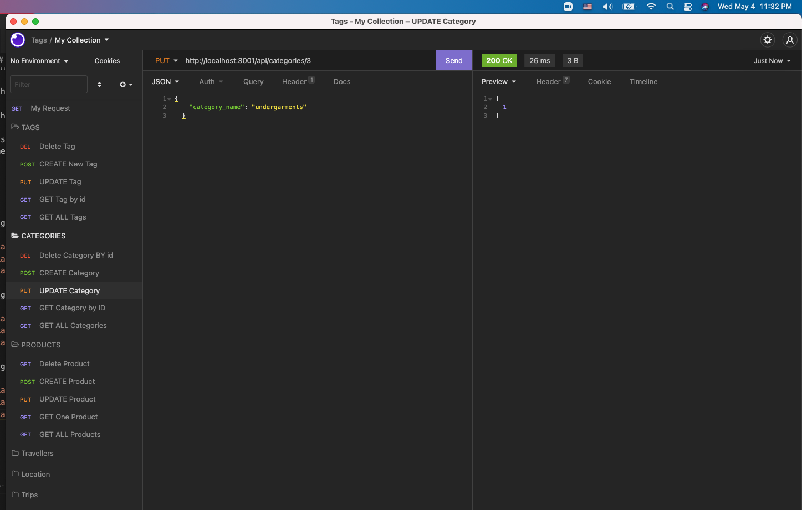

# E-CommerceBackEnd

## Table of Contents

- [Walkthrough video](#walkthrough-video)
- [Descripttion](#descripttion)
- [Installation](#installation)
- [Mock-Up](#mock-up)
- [Questions](#questions)

---

## Walkthrough video

[walkthrough video ](https://watch.screencastify.com/v/vfjAih5qTvsACaAFiqpY)  

---

## Descripttion

The managers at an internet retail company WANT a back end for their e-commerce website that uses the latest technologies SO THAT their company can compete with other e-commerce companies

WHEN the managers add their database name, MySQL username, and MySQL password to an environment variable file
THEN the managers are able to connect to a database using Sequelize

WHEN the managers enter schema and seed commands
THEN a development database is created and is seeded with test data

WHEN the managers enter the command to invoke the application
THEN their server is started and the Sequelize models are synced to the MySQL database

WHEN the managers open API managers GET routes in the managersnsomnia for categories, products, or tags
THEN the data for each of these routes is displayed in a formatted JSON

WHEN the managers test API POST, PUT, and DELETE routes in Insomnia
THEN the managers are able to successfully create, update, and delete data in their database

---

## Installation

    * Uses the [dotenv](https://www.npmjs.com/package/dotenv) package to use environment variables to store sensitive data.

    * Uses the [MySQL2 package](https://www.npmjs.com/package/mysql2) to connect to a MySQL database.

    * Uses the [console.table package](https://www.npmjs.com/package/console.table) to print MySQL rows to the console.

node index.js
Use environment variables to store sensitive data like your MySQL username, password, and database name.

---

## Mock-Up

The following pic shows the application's GET routes to return all categories, all products, and all tags being tested in Insomnia:

The following pic shows the application's GET routes to return a single category, a single product, and a single tag being tested in Insomnia:

The following pic shows the application's POST, PUT, and DELETE routes for categories being tested in Insomnia:

---

## Questions

Feel free to reach out via Github or email with any questions.  
[Github](https://github.com/kayjinyi)  
[email](mailto:kayjinyi@gmail.com)

---
